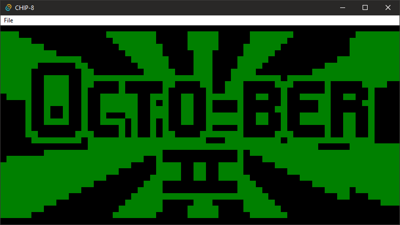

# CHIP8-Tauri

This is a [Tauri](https://tauri.app/)-based GUI for the https://github.com/noirotm/chip8 VM.

Supports display, keyboard (with the default key mapping), and sound.

A limitation at the moment is that when loading an image through the menu,
the previous one will still be running, so they will conflict with each other.

